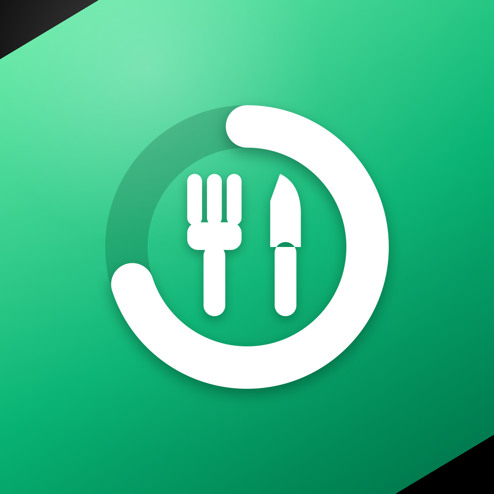
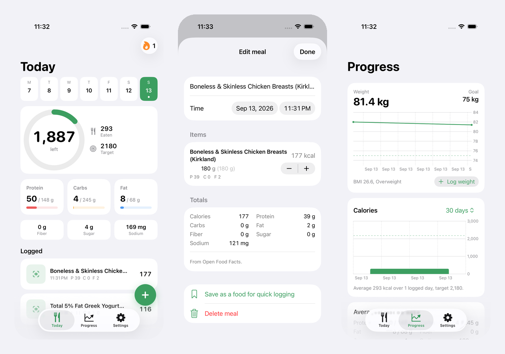

<p align="center">
  
</p>

<h1 align="center">Plate</h1>

<p align="center">
  Photograph a meal, get calories and macros, fix what the camera got wrong, done. A calorie tracker for iPhone with no subscription and no account.
</p>

<p align="center">
  <a href="https://github.com/Dunebru/plate/releases/latest"></a>
  
  
  <a href="LICENSE"></a>
</p>

<p align="center">
  
</p>

Cal AI, MyFitnessPal Premium, and the other photo trackers charge $50 to $80 a year, keep your food photos on their servers, and hide the barcode scanner behind a paywall. Plate does the same job with your own model API key (Google Gemini Flash-Lite answers in about two seconds; its free tier allows about 20 scans a day per model and Plate moves to the next model when one runs out, or with billing on $10 covers roughly 5,000 scans; Anthropic is the pricier option at about three cents a photo), Open Food Facts for barcodes, and Apple Health for everything else. Your log lives in SwiftData on the phone and in Health, nowhere else.

<details>
<summary>Table of contents</summary>

- [Features](#features)
- [Install](#install)
- [Usage](#usage)
- [How the numbers are made](#how-the-numbers-are-made)
- [FAQ](#faq)
- [Build from source](#build-from-source)
- [License](#license)
- [Acknowledgements](#acknowledgements)

</details>

## Features

- **Scan food**: one photo becomes a list of components with portions, calories, protein, carbs, fat, fiber, sugar, and sodium. Hidden oil and sauces are counted
- **Fix results**: tell it "that was brown rice, about two cups" and the whole meal is re-estimated around your correction. Every portion is a stepper, and totals always follow the items
- **Barcode and label**: packaged food from Open Food Facts, or photograph the nutrition facts panel and let the model read it
- **Describe**: type "two eggs, sourdough with butter, black coffee"
- **Saved foods and search**: re-log anything in two taps, create custom foods, search Open Food Facts by name
- **Targets that make sense**: Mifflin-St Jeor resting energy, activity multiplier, your chosen pace, protein by body weight. Edit any number
- **Reality check**: after two weeks, Plate compares what you logged with what the scale did and tells you your real maintenance calories
- **Apple Health**: every meal is written as dietary energy and nutrients (edits and deletes sync too). Steps, active energy, and weight are read back. Optional workout calorie add-back and calorie rollover
- **Progress**: weight trend against your goal, calorie history with the target line, weekly averages, streak
- **Export**: your whole log as CSV

## Install

Plate is not on the App Store. Build it with Xcode and put it on your phone with your free Apple developer account (a paid account is not needed for your own devices).

```bash
brew install xcodegen
git clone https://github.com/Dunebru/plate.git && cd plate
xcodegen generate
open Plate.xcodeproj
```

In Xcode: select the Plate target, Signing & Capabilities, pick your team, then Run with your iPhone selected. Or from the terminal with the phone plugged in:

```bash
scripts/install-device.sh <YOUR_TEAM_ID>
```

Requires iOS 18 or newer. Photo, label, and description logging need an API key, entered once in Settings and kept in the keychain: a free Gemini key from aistudio.google.com, or an Anthropic key from console.anthropic.com. Barcodes, search, saved foods, and manual entry work without one.

## Usage

1. Answer the onboarding questions. Plate shows the plan it computed and why.
2. Tap the plus. Scan a plate, a barcode, or a label, or describe the meal.
3. Check the portions on the review screen. Correct anything wrong, then Log.
4. Log your weight a few times a week on the Progress tab. After two weeks the reality check tells you if the target needs to move.

## How the numbers are made

- Resting energy: Mifflin-St Jeor. Maintenance: resting times 1.2 to 1.9 depending on activity.
- Goal: 7,700 kcal per kilogram, spread over the week at the pace you pick. Floors at 1,500 kcal (men) and 1,200 kcal (women).
- Protein: 1.8 g per kg when losing or gaining, 1.6 g when maintaining, capped at 40 percent of calories. Fat: 28 percent of calories. Carbs: the rest.
- Photo estimates: the model lists each component with a portion and per-unit nutrients from USDA-style reference values. Totals are summed on the phone, so changing a portion changes everything.
- Reality check: implied maintenance equals average intake minus the calories represented by your weight change over the period. Needs 14 days, 10 logged days, and two weigh-ins.

## FAQ

**How accurate is a photo?**
Usually within 10 to 30 percent, worse for stews, curries, and restaurant food where oil is invisible. That is the same range as every photo tracker, which is why the review screen exists. Consistency beats precision: the weekly trend and the reality check are what you should trust.

**Which model does it use?**
Google Gemini Flash-Lite by default, the fastest and cheapest model that reads photos. Plate falls back to the full size Flash models when Lite is busy, and picks current models on its own, so it keeps working when Google retires an older one. Switch to Anthropic in Settings for Claude Opus 5 or Sonnet 5. Requests go straight from the phone to the provider with your key. Nothing goes through any other server.

**Why does it need Apple Health?**
It does not. Turn it off in Settings and everything stays local to the app. With it on, other apps and your watch see your nutrition, and Plate can add workout calories to the budget.

**Can I use it without a key at all?**
Yes. Barcodes, search, saved foods, and custom foods never touch the model.

## Build from source

```bash
brew install xcodegen
git clone https://github.com/Dunebru/plate.git && cd plate
xcodegen generate
xcodebuild -project Plate.xcodeproj -scheme Plate -destination 'platform=iOS Simulator,name=iPhone 17 Pro' test
```

Plate is a plain SwiftUI app: SwiftData for storage, Swift Charts, HealthKit, VisionKit for barcodes, AVFoundation for the camera. No third-party packages.

## License

[MIT](LICENSE) © dunebru

## Acknowledgements

- [Open Food Facts](https://world.openfoodfacts.org) for the product database, ODbL
- Mifflin MD, St Jeor ST, et al. A new predictive equation for resting energy expenditure in healthy individuals. Am J Clin Nutr 1990
